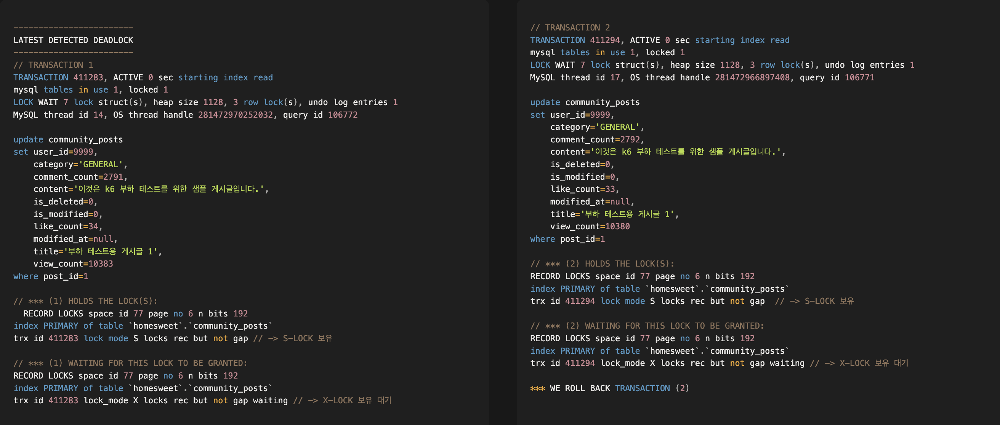
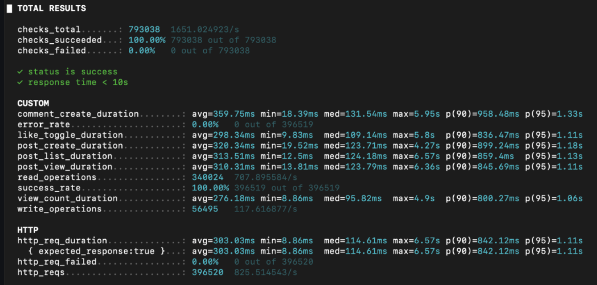
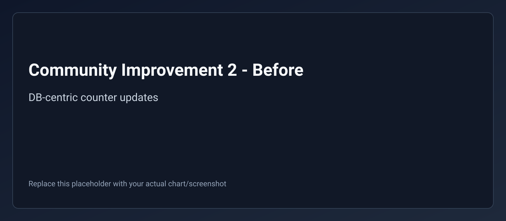
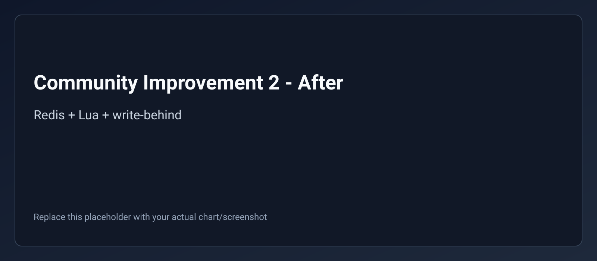

# 개발 사이클에 맞춰 성능을 개선한 이커머스 프로젝트, HomeSweetHome

---

## 📽️ 시연영상

https://www.youtube.com/watch?v=tDZQVn2-uPs

---

## 🔖 프로젝트 개요

- 주제 : 국내 홈리빙 이커머스 서비스를 벤치마킹하여, 주문·결제와 커뮤니티 핵심 기능을 구현하고 성능을 개선한 프로젝트
- 개발 프로세스 : 기획 및 MVP 구축 → 단위/통합/부하 테스트 기반 병목 분석 → 개선 적용 및 재검증 반복

---

## 📚 기술 스택

---

## 🌏 서버 아키텍쳐

---

## 🔗 담당 핵심 기능 (대표 기능 중심)

### 1️⃣ 주문 및 결제 시스템

- 단일/다건 주문 생성 : 장바구니 기반으로 여러 상품을 한 번에 주문할 수 있습니다.
- 결제 승인/취소/조회 : Toss 결제 흐름(주문 생성 → 결제 승인 → 결제 조회/취소)을 API로 제공합니다.
- 결제 멱등성 보장 : `paymentKey` 기준 멱등성 키를 사용해 중복 승인 요청을 차단합니다.
- 주문 단위 동시성 제어 : `orderId` 기준 Redis 락으로 동일 주문의 동시 결제 시도를 제어합니다.
- 결제 정합성 유지 : 외부 승인 후 내부 저장 실패 시 보상 취소(Compensation)로 상태 불일치를 방지합니다.

### 2️⃣ 커뮤니티 시스템

- 게시글/댓글 기능 : 게시글·댓글 CRUD 및 좋아요 토글 기능을 제공합니다.
- 실시간 카운터 : 조회수/좋아요수/댓글수를 Redis 카운터로 처리합니다.
- 원자적 동시성 제어 : Lua Script로 좋아요 토글/카운터 증감을 원자적으로 수행합니다.
- 비동기 동기화 : Event Queue + Scheduler 기반 Write-Behind 패턴으로 Redis 데이터를 DB에 동기화합니다.
- 조회 최적화 : Bulk MGET, 캐시 워밍업, 캐시 무효화(SCAN) 전략을 적용합니다.

---

## 🚀 개선 사항

### 1️⃣ 결제 시스템 1차 개선 - 동시성 제어 및 정합성 강화

#### 문제 상황

- 동일 결제 요청이 중복으로 들어오면 중복 승인/중복 처리 위험이 존재
- 외부 결제 승인 성공 후 내부 DB 처리 실패 시 결제 상태와 주문 상태가 불일치
- 고동시성 구간에서 결제 흐름 안정성이 낮음

#### 해결 방법

- Redis 멱등성 키(`payment:idempotency:*`) 도입으로 동일 `paymentKey` 중복 처리 차단
- 주문 락(`payment:lock:order:*`) 도입으로 동일 주문 결제 요청 직렬화
- 락 해제는 Lua Script 기반 토큰 검증 방식으로 안전하게 처리
- 외부 승인 성공 후 DB 저장 실패 시 결제 취소 보상 트랜잭션 적용

#### 결과

- 중복 결제 승인 방지 구조 확보
- 외부 결제 상태와 내부 주문 상태 정합성 강화
- 결제 실패 케이스에서 복구 가능성 확보

개선 전  

개선 후  

---

### 2️⃣ 결제 시스템 2차 개선 - 외부 PG 장애 대응 및 테스트 환경 개선

#### 문제 상황

- PG 연동 오류가 단일 500 응답으로 처리되어 원인 식별이 어려움
- 실PG 호출 제약으로 로컬/부하 테스트 반복 검증이 어려움

#### 해결 방법

- Toss 연동 예외를 인증 오류(401), 클라이언트 오류(4xx), 연동 실패(5xx/기타)로 분리
- Resilience4j Circuit Breaker + Retry 정책 적용
- dev/test 환경에서 Mock TossPaymentsService를 사용하도록 분리

#### 결과

- 장애 유형별 대응 전략(재시도/즉시 실패/관측) 적용 가능
- 테스트 환경에서 결제 플로우 반복 검증 가능
- 결제 장애 분석 속도와 운영 안정성 향상

개선 전  

개선 후  

---

### 3️⃣ 커뮤니티 1차 성능 개선 - 데드락 문제 해결

#### 문제 상황

- `PESSIMISTIC_WRITE` 기반 조회 후 수정 패턴에서 데드락 발생
- k6 부하 테스트 중 `Deadlock found when trying to get lock` 오류가 빈번히 발생
- FK 제약이 있는 부모/자식 테이블 락 순서 불일치로 충돌 발생

#### 해결 방법

- `SELECT FOR UPDATE` 후 엔티티 수정 방식 제거
- JPQL/네이티브 Atomic UPDATE/DELETE로 직접 갱신
- Resource Ordering 적용: 부모(posts) 먼저, 자식(post_likes) 나중 처리
- `@Modifying(clearAutomatically = true, flushAutomatically = true)` 적용

#### 결과

- 데드락 발생 빈도 개선 : **빈번 발생 → 0회**
- 동시성 에러 응답 감소
- 카운터 갱신 안정성 확보

개선 전  

개선 후  

---

### 4️⃣ 커뮤니티 2차 성능 개선 - Redis 기반 카운터 시스템 구축

#### 문제 상황

- 조회수/좋아요 연산이 DB 중심으로 처리되어 커넥션/트랜잭션 부하 집중
- 단순 +1 연산도 DB 왕복이 필요해 트래픽 증가 시 병목 발생
- Race Condition 방지와 저지연 응답을 동시에 만족시키기 어려움

#### 해결 방법

- Redis를 실시간 카운터 처리 계층으로 분리
- Lua Script로 좋아요 토글/카운터 연산을 원자적으로 처리
- Event Queue 기반 좋아요 이벤트 적재 + Scheduler 배치 동기화(Write-Behind)
- Cache Miss 시 DB 초기 로딩(Cache-Aside) 적용

#### 결과

- DB 직접 갱신 빈도 감소
- 고빈도 카운터 연산의 처리 지연 감소
- 정합성/동시성/성능 균형을 갖춘 구조로 전환

개선 전  

개선 후  

---

### 5️⃣ 커뮤니티 3차 성능 개선 - DB 쿼리 최적화 및 캐싱 전략

#### 문제 상황

- 게시글 목록 조회 시 Redis N+1 호출 발생
- 페이지네이션 COUNT 쿼리 부하가 큼
- 인덱스 비효율로 Full Table Scan 발생

#### 해결 방법

- 복합 인덱스(`is_deleted`, `created_at DESC`) 추가
- 카운터 조회를 Bulk MGET으로 일괄 처리
- 캐시된 목록 + 최신 카운터 재주입 전략 적용
- 캐시 무효화 시 `KEYS` 대신 `SCAN` 사용

#### 결과

- Redis 호출 수 개선 : **30회/요청 → 3회/요청**
- 목록 조회 p95 개선
- DB 조회 부하 감소

개선 전  

개선 후  

---

## 🚀 트러블 슈팅

### 1️⃣ 카운터 정합성과 동시성을 유지하며 성능 향상의 어려움

#### 문제 상황

- 정합성(Consistency), 동시성(Concurrency), 성능(Performance)을 동시에 만족시키기 어려움
- 강한 락 기반 접근은 성능 저하, 단순 캐싱은 정합성 훼손 위험

#### 해결 방법

- 1차: Atomic Query로 데드락 제거
- 2차: Redis + Lua + Write-Behind로 실시간 처리와 정합성 동시 확보
- 3차: Bulk 조회 + 인덱스 + 캐시 전략으로 조회 경로 최적화

#### 결과

- 병목 구간을 단계적으로 분리해 해결
- 서비스 특성에 맞는 현실적인 트레이드오프 의사결정 경험 축적

### 2️⃣ 외부 결제 API 호출 제약 → Mock 기반 테스트 환경 구성

#### 문제 상황

- 실제 PG API는 성능 테스트/반복 호출에 제약이 존재
- 외부 API 의존도가 높아 테스트 재현성이 낮음

#### 해결 방법

- Mock Toss 결제 서비스 도입
- 프로필 기반으로 실제/Mock 결제 서비스 분리
- k6 시나리오를 Mock 기준으로 반복 실행 가능한 형태로 정리

#### 결과

- 결제 시나리오의 반복 검증 가능
- 외부 API 제약 없이 병목 구간 분석 가능
- 회귀 테스트 안정성 향상

---

## 📖 Wiki 및 참고 자료

프로젝트 진행 중 겪었던 문제 해결 과정과 기술적 결정에 대한 자세한 내용은 아래 Wiki에서 확인할 수 있습니다.

### ⚙️ 1. 개선사항 및 트러블 슈팅

- 커뮤니티 1차 성능 개선 - 데드락 문제 해결
- 커뮤니티 2차 성능 개선 - Redis 기반 카운터 시스템 구축
- 커뮤니티 3차 성능 개선 - DB 쿼리 최적화 및 캐싱 전략
- 카운터 정합성과 동시성을 유지하며 성능 향상의 어려움

### 🗒️ 2. 기타 (Notes / Additional Info)

- CS스터디 스레드와 프로세스에 대하여
- CS스터디 Redis
- 글로벌 batchsize 미팅 제안서

- Wiki로 이동하기: [HomeSweetHome Wiki](https://github.com/ohhalim/HomeSweetHome-backend/wiki)

---

## 👥 Team

<table align="center">
  <tr>
    <td align="center">
      
       오하림 
      <a href="https://github.com/ohhalim">@ohhalim</a>
    </td>
    <td align="center">
      
       안채호 
      <a href="https://github.com/chaeho5">@chaeho5</a>
    </td>
    <td align="center">
      
       김도경 
      <a href="https://github.com/dogyungkim">@dogyungkim</a>
    </td>
    <td align="center">
      
       주아현 
      <a href="https://github.com/Jooahyeon">@Jooahyeon</a>
    </td>
    <td align="center">
      
       김준우 
      <a href="https://github.com/normaldeve">@normaldeve</a>
    </td>
    <td align="center">
      
       권희수 
      <a href="https://github.com/ssooyya">@ssooyya</a>
    </td>
  </tr>
</table>
